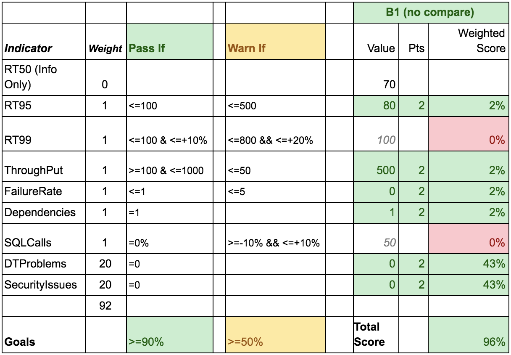

# Keptn Quality Gates
Let's say you want to use your existing tools for deploying and testing your applications - you can still use Keptn Quality Gates for evaluation of service level objectives (SLOs). At first we describe our understanding of service level objectives and how they can be configured. Then we describe how a user would work with the Keptn Quality Gates for evaluation.

## Prerequisites
*   Running Keptn installation
*   Service level objectives for each service you want to evaluate
*   Supported tools that Keptn can query for service level indicators for evaluation (initial version will support Prometheus and Dynatrace)

## Service Level Objectives
A service level objective (SLO) is a target value or range of values for a service level that is measured by a service level indicator (SLI). An SLI is a carefully defined quantitative measure of some aspect of the level of service that is provided.

### Service Level Indicators
By default, the following SLIs can be used for evaluation, inspired by the Site Reliability Engineering book from Google ([SRE Book](https://landing.google.com/sre/sre-book/chapters/service-level-objectives)).

#### Response Time
The time it takes for a service to execute and complete a task or how long it takes to return a response to a request.
- `response_time_p50` (median)
- `response_time_p90` (90th percentile)
- `response_time_p95` (95th percentile)

#### System Throughput
The number of requests per second that have been processed.
- `throughput`

#### Error Rate 
The fraction of all received requests that produced an error.
- `error_rate`

### Service Level Objectives Configuration
An SLO consists of an SLI, a service filter that uniquely identifies a service, and evaluation success criteria that depends on the selected comparison strategy. Here’s an example of a minimal SLO - the details to each configuration item are described below.

```yaml
spec_version: '1.0'
filter:
  - id: "<prometheus_scrap_job_id>"
comparison:
- compare_with: "single_result"
- only_compare_with: "pass"
objectives:
- sli: "error_rate"
  pass:
  - criteria:
    - "<=+2%"
total_score:
- pass: "100%"
```

#### Filter
SLOs are defined per service. A service filter is a key-value pair and the following list contains all valid keys for service filters. The service filters project, stage, and service can be inferred from the Keptn configuration by using $PROJECT, $STAGE, and $SERVICE respectively. These values can also be overwritten in the configuration. The service filter id can be used to specify a unique identifier of that service, for example a scrape job name for Prometheus or a service ID for Dynatrace.
*   project
*   stage
*   service
*   id

#### Comparison
By default, Keptn compares with the previous values of the SLIs. The “compare_with” configuration parameter controls how many previous results are compared: single_result or several_results. The “only_compare_with” configuration parameter controls which of the previous results are included in the comparison: pass, pass_or_warn, all (default, also used if not specified). For example,

```yaml
comparison:
- compare_with: "single_result"
- only_compare_with: "pass"
```
means that the current result is only compared to the last result that passed. Whereas if

```yaml
comparison:
- compare_with: "several_results"
- only_compare_with: "pass_or_warn"
- number_of_comparison_results: 3
- aggregate_function: "avg"
```

the current result is compared to the average of the three previous results that had pass or warning as a result.

#### Objectives
An objective consists of an SLI, a `pass` criteria and an optional `warning` criteria and an optional `weight`. `pass` represents the upper limit up to which an evaluation is successful. `warning`, if defined, describes the border where the result is not pass and not fail, and a manual approval might be needed to decide. `weight` can be used to emphasize the importance of one SLI over the others. By default, `weight` is 1 for all SLIs and can be overwritten. The weight is important for calculating the score later.

The following example demonstrates how the objectives work. Assume the following comparison strategy and SLI objective.

```yaml
comparison:
- compare_with: "single_result"
- only_compare_with: "pass"
objectives:
- sli: "error_rate"
  pass:
  - criteria:
    - "<=+5%"
```

Further assume, that in the previous evaluation error_rate was 5%. The upper limit for pass is 5.25% (5 + 5%). The following list shows the evaluation results for all possible error_rate values.
*   pass: <= 5.25%
*   fail: > 5.25%

At the end of the document is a detailed example of a SLO definition with all sorts of value.

#### Scoring
An evaluation for “pass” counts for one point, an evaluation for “warning” half a point, and an evaluation for “fail” zero points. The default weight of an SLI is 1 and can be overwritten. The maximum score is the sum of the weights of all SLIs.

The actual evaluation result is divided by the maximum score and gives the `total_score` in percent. For example, the maximum score is 92 and the evaluation result is 85 - the `total_score` is 92.39% (85/92*100).

The pass and warning criteria for the `total_score` use the logical operator “>=” by default.

## User Walkthrough
### Configure Keptn
Create a Keptn project that represents the deployment stages, if applicable. If in doubt, specify only one named stage.

```
keptn create project PROJECTNAME --shipyard shipyard.yaml
```

shipyard.yaml:
```yaml
stages:
- name: "hardening"
```

Configure Keptn services by applying a Keptn Uniform. The only mandatory service for Keptn Quality Gates is the evaluation-service that responds to a start-evaluation event. The evaluation service needs a SLI provider, an endpoint and credentials, if needed. If a visualization in the Keptn’s bridge of the entire delivery workflow is desirable, a noop-service can be configured for other events.

```
keptn add secret secret.yaml #(if needed for SLI provider)
keptn apply uniform --project PROJECTNAME uniform.yaml
```

uniform.yaml
```yaml
services:
- name: "noop-service"
  image: "keptn/noop-service:1.0"
  events: ["start_deployment", "start-tests"]
- name: "evaluation-service"
  image: "keptn/evaluation-service:0.8"
  events: ["start_evaluation"]
  sli-provider: "prometheus"
  - endpoint: "http://1.2.3.4"
  - api-token:
    - secretKeyRef: mysecret
    - key: api-token
```

Create a Keptn service in said project for each service that should be evaluated using Keptn Quality Gates and provide a slo.yaml.

```
keptn create service SERVICENAME --project PROJECTNAME
keptn add resource --project PROJECTNAME --stage STAGE --service
    SERVICENAME --resource slo.yml
```

### Evaluate Keptn Quality Gates

Evaluating a service with Keptn Quality Gates consists of:

1. Informing Keptn about the beginning and end of a deployment
2. Informing Keptn about the beginning and end of the test execution
3. Starting the evaluation of Keptn Quality Gates
4. Polling for the results

Informing Keptn about the beginning and end of a deployment or test execution is done through the Keptn CLI. This gives Keptn information about when a deployment has been done and when tests have been run.

```
keptn send event deployment.started --project PROJECTNAME --stage STAGE --service SERVICE
// deployment of artefact happens here
keptn send done --keptnContext 1234-5678-90

keptn send event tests.started --project PROJECTNAME --stage STAGE --service SERVICE --reference test-run-A
// test execution happens here
keptn send done --keptnContext 1234-5678-90
```

Start the evaluation of the Keptn Quality Gates using the Keptn CLI. 

```
keptn send event evaluation.start --project PROJECTNAME --service SERVICENAME
```

This command returns a keptnContext, a UUID, that we need in the next step to query for the results of the evaluation. Keptn will evaluate the service level objectives of the specified service in the specified project and will save the results. 

Use the Keptn CLI and the previously received keptnContext to pull evaluation results.

```
keptn get event evaluation.done --keptn-context 1234-5678-90
```

The results come in the form of a cloud event, similar to the one that is specified here: [CloudEvent evaluation-done](https://github.com/keptn/spec/blob/master/cloudevents.md#evaluation-done).

### SLO - a detailed Example

```yaml
spec_version: '1.0'
# filter is optional
# specifies selection criteria for service in the SLI provider; project, stage,
# and service can be overwritten, if needed
filter:
  id: "<e.g. prometheus_scrape_job_id>"
# comparison is mandatory
comparison:
  # compare_with is mandatory
  # possible values:
  # - single_result: only compare with one previous result
  # - several_results: compare with several previous results
  #   this option requires 'number_of_comparison_results'
  compare_with: "single_result"
  # include_result_with_score is optional
  # default value: all
  # possible values:
  # - pass: only use previous results that had a 'pass' result in comparison
  # - pass_or_warn: only use previous results that had a 'pass' or a 'warning'
  #   result in the comparison
  # - all: all previous values are used in the comparison
  include_result_with_score: "pass"
  # number_of_comparison_results is optional
  # default value: 3
  # possible values are positive integers greater than zero
  # if less than 3 values are available for comparison the evaluation fails
  number_of_comparison_results: 3
  # aggregate_function is optional
  # decides on the aggregate function which is applied to the previous results
  # before comparison
  # default value: avg
  # possible values:
  # - avg: average
  # - p90: 90th percentile
  # - p95: 95th percentile
  aggregate_function: avg
# objectives is mandatory
# describes the objectives for SLIs
objectives:
  # sli is mandatory
  # can be specified several times, if sli is specified without further attributes
  # the values are fetched and stored but are not taken into account for the
  # evaluation
  - sli: responseTime95
    # pass is optional
    # it defines the pass criteria for the SLI values
    pass:        # pass if (relative change <= 10% OR absolute value is < 200)
      # e.g.: If response time changes by more than 10%, it should still
      #       be considered as a pass if it is less than 200 ms
      - criteria:
        - "<=+10%" # relative values require a prefixed sign (plus or minus)
      - criteria:
        - "<200"   # absolute values only require a logical operator
    warning:   # allow small relative changes, and response time has to be < 500 ms
      - criteria:  # criteria connected by AND
        - "<+15%"
        - ">-8%"
        - "<500"
  - sli: security_vulnerabilities
    weight: 2   # default weight: 1
    pass:       # do not allow any security vulnerabilities
      - criteria:
        - "=0"
  - sli: sql_statements
    key_sli: true # if a key sli fails, the whole evaluation fails
    pass:         # pass
      - criteria:   # if there has been no change to the number of sql statements
        - "=0%"
      - criteria:   # or if the total number of sql statements is below 100
        - "<100"
    warning:      # warn if the number of sql statements has changed slightly
      - criteria:
        - "<+5%"
        - ">-5%"
total_score:  # maximum score = sum of weights
  pass: "90%" # by default this is interpreted as ">="
  warning: 75%
```

## Appendix
An example of how the weighted quality evaluation works is shown here: 

