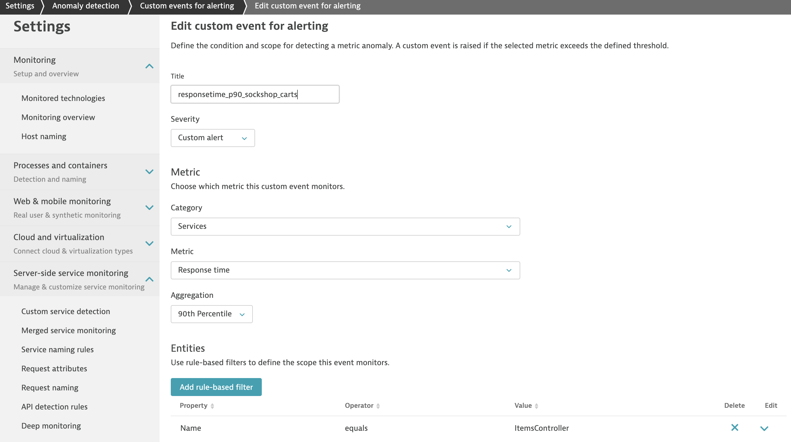

# Keptn Feature-Toggle Self-Healing

This document describe how Keptn leverages feature toggle frameworks to enable self-healing for applications by automatically toggling feature toggles in response to problem tickets that are reported to Keptn.

At first, we describe how to write remediation actions agnostic to the actual feature toggle framework used. Secondly, we describe how a user would work with Keptn as a control plane to toggle feature flags for automated operations of the users applications. 
Please note that in the current version, Keptn will provide built-in functionality for the open-source feature toggle framework [Unleash](https://unleash.github.io/), with other feature toggle platforms to follow.


# Prerequisites


*   Running Keptn Installation
*   Running [Unleash](https://unleash.github.io/) server as the feature toggle framework
*   Application with feature flags connected to the Unleash server
*   Remediation file with feature flags to toggle in case of issues
*   Running monitoring solution for the application (right now Dynatrace is supported)


# Remediation file

The remediation file is necessary to define which remediation action should be taken in response to a problem ticket that is sent to Keptn. Keptn’s internal remediation service will then determine the actions to take and trigger them accordingly. 

Here’s an example of a remediation file:

remediation.yaml

```yaml
remediations:
- name: responsetime_p90_sockshop_carts
  actions:
  - action: featuretoggle
    value: enablecache:on
```


*   `name`: it is the name of the violated SLO or type of problem.
*   `actions`: a list of actions that can be executed to remediate the problem
*   `action`: name of the action as well as the value which should be set. I.e., the action should be set to `featuretoggle`, the value defines which feature toggle as well as the new value the feature toggle should be set to.


# User Walkthrough


## Setup & Configure Keptn 


### Create project 

Create a Keptn project which where you want to onboard your service. Define all stages you want to have in your project in a shipyard file, similar to the [Keptn docs](https://keptn.sh/docs/0.5.0/usecases/onboard-carts-service/#create-project-sockshop).

```
keptn create project PROJECTNAME --shipyard=shipyard.yaml
```

### Add secret for Unleash server

Add a secret to let Keptn access the Unleash server and toggle the feature flags.

unleash-secret:

```yaml
apiVersion: v1
kind: Secret
metadata:
  name: unleash-secret
type: Opaque
data:
  username: unleash-username
  token: unleash-token
  server-url: unleash-server-url
```


Apply the secret to the cluster.

```
kubectl apply -f unleash-secret -n keptn
```

<!--
ALTERNATIVE

```
#keptn add secret secret.yaml # needed to access the unleash server
#keptn apply uniform --project=PROJECTNAME uniform.yaml
```

uniform not needed right now since unleash is built in as action in Keptn core remediation service 
-->


### Onboard a service

Onboard the service and add the remediation file as a resource.


```
keptn onboard service SERVICENAME --project=PROJECTNAME --chart=HELMCHART
```


Configure Keptn - add the remediation file


```
keptn add-resource --project=PROJECTNAME --service=SERVICENAME --stage=STAGENAME --resource=remediation.yaml
```


### Configure your monitoring

To be able to react on any issues in your environment, the monitoring solution has to be setup and configured to send details of the detected issue to Keptn. In case of Dynatrace, this is how it would look like:

1. Follow the Keptn docs to setup Dynatrace [as described here](https://keptn.sh/docs/0.5.0/reference/monitoring/dynatrace/).

2. Set up a custom alert rule to be notified if the 90th percentile of the response time of your service is slower than expected. This custom alert rule does very much depend on your [SLOs](https://github.com/keptn/spec/blob/master/sre.md). 

    An example can be seen in this screenshot:
    


### Watch self healing in action

Now, if the response time of your service is slower than defined in your SLOs, the monitoring tool will send out an alert (problem ticket) to Keptn. Keptn on the other hand will find that there is a remediation set for the affected service (defined in the remediation.yaml file). Thus, Keptn will trigger the remediation, by making an API call to the feature toggle server and set the toggle to the desired state described in the remediation action.


# **ACTION ITEMS for implementation**

*   Setup Unleash server for demo
*   Integrate Feature toggle into demo application
*   Build featuretoggle action for remediation service
*   Provide load generation script
*   Provide instructions to setup custom alerting rule in Dynatrace (not yet available via API)

